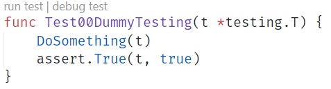

# Developer Guide for Testing

- [Developer Guide for Testing](#developer-guide-for-testing)
- [Intro](#intro)
- [Installing software](#installing-software)
- [Add VS Code Go support](#add-vs-code-go-support)
- [Ensuring all Go modules are installed](#ensuring-all-go-modules-are-installed)
- [Understanding Go test](#understanding-go-test)
  - [Understanding Build Tags](#understanding-build-tags)
  - [Running all tests](#running-all-tests)
- [Configuring the test environment](#configuring-the-test-environment)
- [Running and Debugging tests in VS Code](#running-and-debugging-tests-in-vs-code)
  - [Configuring VS Code test environment variables](#configuring-vs-code-test-environment-variables)
  - [Leveraging `.env` Files for Configuration](#leveraging-env-files-for-configuration)
- [Creating New Tests](#creating-new-tests)
- [Defining Test Data](#defining-test-data)
  - [Read KeyVault Variables](#read-keyvault-variables)
  - [Custom Variables](#custom-variables)
  - [Local Validation](#local-validation)
  - [Read Yaml values](#read-yaml-values)

## Intro

This guide covers all instructions required to run and write tests to validate the Terraform deployments in the terraform-template-public repo.

We are using Terratest (<https://github.com/gruntwork-io/terratest>), a Go library to automate tests for infrastructure code.

In the typical usage, Terratest allows invoking the terraform init and apply steps to provision an environment, and then using its helper functions to test if the environment is set up as expected. At the end of the test, the environment is de-provisioned (terraform destroy).

In this repo we are not following this strategy: instead, we are using Terratest to perform integration testing as part of a CI/CD pipeline. The Azure environment is provisioned in a previous step and we are only using the helper functions of Terratest to validate the environment is correctly set up.

## Installing software

- VS Code: <https://code.visualstudio.com/download>
- Go (version 1.14.1 or up is recommended): <https://golang.org/doc/install>
- Git: <https://git-scm.com/book/en/v2/Getting-Started-Installing-Git>
- Azure CLI: <https://docs.microsoft.com/cli/azure/install-azure-cli?view=azure-cli-latest>

Verify your Go installation by running:

```BASH
$ go version
go version go1.14.1 linux/amd64
```

## Add VS Code Go support

Install the Go extension on VS Code:
Open VS Code and search for "ms-vscode.go" on the Extensions tab.

Alternatively, browse to <https://marketplace.visualstudio.com/items?itemName=ms-vscode.Go> and install from there.

In VS Code, use Ctrl+Shift+P to execute a command and choose the **Go:Install/Update Tools** -> select all tools and click "Ok"

## Ensuring all Go modules are installed

After cloning the repository or switching to a new branch, it's a good idea to make sure your go modules are correctly configured:

Go to the **test** directory and execute the following command:

```BASH
go mod tidy -v
```

Note: if you run into issues after switching branches, clean up the mod cache by doing:

```BASH
go clean -modcache
```

## Understanding Go test

Go to the **test/terraform** directory. There are several tests in this directory. Let's look at **00_dummy_test.go**:

```GO
// +build 00 dummy

package terraform_test

import (
  "os"
  "testing"

  "github.com/stretchr/testify/assert"
)

func Test00DummyTesting(t *testing.T) {
  DoSomething(t)
  assert.True(t, true)
}

func Test00DummyFailTesting(t *testing.T) {
  assert.True(t, false)
}

func DoSomething(t *testing.T) {
  t.Log("Doing Something...")
  value := os.Getenv("FOO")
  t.Log(value)
}
```

To run this test execute the following command:

```bash
$ go test -v 00_dummy_test.go
=== RUN   Test00DummyTesting
    Test00DummyTesting: 00_dummy_test.go:21: Doing Something...
--- PASS: Test00DummyTesting (0.00s)
=== RUN   Test00DummyFailTesting
    Test00DummyFailTesting: 00_dummy_test.go:17:
                Error Trace:    00_dummy_test.go:17
                Error:          Should be true
                Test:           Test00DummyFailTesting
--- FAIL: Test00DummyFailTesting (0.00s)
FAIL
```

- Any functions that start with "Test" are executed.
- All other funcs are ignored unless they are called by running tests.
- Any failures resulting from failed assertions or errors will cause the test to FAIL.
- The test run is considered a failure if any tests fail

If you want to run only a set of tests with a particular naming rule, you can pass a matching string to the -run parameter:

```GO
$ go test -v 00_dummy_test.go -run Test00DummyTesting
=== RUN   Test00DummyTesting
    Test00DummyTesting: 00_dummy_test.go:21: Doing Something...
--- PASS: Test00DummyTesting (0.00s)
PASS
ok      command-line-arguments  0.014s

$ go test -v 00_dummy_test.go -run Fail
=== RUN   Test00DummyFailTesting
    Test00DummyFailTesting: 00_dummy_test.go:17:
                Error Trace:    00_dummy_test.go:17
                Error:          Should be true
                Test:           Test00DummyFailTesting
--- FAIL: Test00DummyFailTesting (0.00s)
FAIL
FAIL    command-line-arguments  0.012s
FAIL
```

### Understanding Build Tags

Go `test` looks for any files that end in "_test.go" in the supplied path. Notice, however, that running this command indicates no test files are found:

```bash
$ go test -v .
?       https://dev.azure.com/csedevops/terraform-template-public/_git/terraform-template-public/test/terraform    [no test files]
```

The reason is that all tests in the repo are marked with a Build Tag. This allows us to separate the test runs and we use this mechanism to determine which tests to run in each stage of the CI/CD pipeline, so **it is a requirement** in our setup. All test files marked with a build tag are ignored by *go test* if no tag is specified.

The build tag should be the first statement in the code and **must have a blank line beneath it**.

```GO
// +build 00 dummy
```

In this case we're setting two tags: 00 and dummy. This means we can run this test by referencing any of the tags:

```BASH
$ go test -v -tags=dummy
=== RUN   Test00DummyTesting
    Test00DummyTesting: 00_dummy_test.go:21: Doing Something...
--- PASS: Test00DummyTesting (0.00s)
=== RUN   Test00DummyFailTesting
    Test00DummyFailTesting: 00_dummy_test.go:17:
                Error Trace:    00_dummy_test.go:17
                Error:          Should be true
                Test:           Test00DummyFailTesting
--- FAIL: Test00DummyFailTesting (0.03s)
FAIL
```

or

```BASH
$ go test -v -tags=00
=== RUN   Test00DummyTesting
    Test00DummyTesting: 00_dummy_test.go:21: Doing Something...
--- PASS: Test00DummyTesting (0.00s)
=== RUN   Test00DummyFailTesting
    Test00DummyFailTesting: 00_dummy_test.go:17:
                Error Trace:    00_dummy_test.go:17
                Error:          Should be true
                Test:           Test00DummyFailTesting
--- FAIL: Test00DummyFailTesting (0.03s)
FAIL
```

>You can see multiple test files tagged with the 03 tag. You can execute all of them by using the *-tags=03* argument.
> While developing tests, it is a good idea to add a tag "dev" to each file so that you can execute your tests quickly and in isolation.

### Running all tests

If running in a Linux environment (or [WSL](https://docs.microsoft.com/windows/wsl/install-win10)), you can execute the following command to run all tests in the current directory, regardless of tags:

```BASH
go test -v *.go
```

At the time of this writing, Go for Windows doesn't seem to allow this either from a CMD or Powershell prompt:

```bash
PS> go test -v *.go
go: finding module for package *.go
can't load package: package *.go: malformed module path "*.go": invalid char '*'
```

## Configuring the test environment

To be able to run the tests in this repo, there are two environment variables that need to be set.

Bash:

```bash
export TEST_ENV_FILE_PATH="THE_FILE_PATH_TO_DOT_ENV_FILE"
export ARM_SUBSCRIPTION_ID="AZURE_SUB_ID"
```

Powershell:

```POWERSHELL
$Env:TEST_ENV_FILE_PATH="THE_FILE_PATH_TO_DOT_ENV_FILE"
$Env:ARM_SUBSCRIPTION_ID="AZURE_SUB_ID"
```

Additionally, the tests must be run in the context of an authorized user that has access to the Azure subscription. While developing, the best option is to use Azure CLI to login on the current terminal where tests are run.

If test requires access to secrets stored in the keyvault, az login must be called with a service principal with rights to retrieve secrets:

```bash
az login --service-principal --tenant "tenantId" --username "username" --password "password"
```

## Running and Debugging tests in VS Code

The Go extension for VS Code and the associated tools should allow you to debug and run tests in VS Code.



Additional setup details for VS Code can be found on GitHub at the following link: https://github.com/golang/vscode-go/blob/master/docs/debugging.md

However, you will find that, by default, VS Code does not seem to work. Again, this is due to the Build Tags (in the background, the VS extension just runs **go test** commands). You will see errors stating that it cannot find any test files. Fortunately, VS Code allows us to change it's base configuration.

You can alter this behavior by creating a settings.json file under your .vscode directory (local settings for the workspace) with the following code:

```JSON
{
    "go.testFlags": ["-v"],
    "go.testTags": "dev",
    "go.testEnvVars": {
        "FOO":"BAR"
    }
}
```

This enables the verbose option and passes the correct tags to the *go test* command. Again, **I recommend setting a "dev" build tag on whatever files you're working with** so that you can use this configuration in all tests under development.

It is also recommended to add a debug configuration to the launch.json file under the .vscode directory:

```json
{
    "name": "Launch Test",
    "type": "go",
    "request": "launch",
    "mode": "auto",
    "program": "${file}",
    "buildFlags": "-tags=dev -v",
    "env": {
        "FOO":"BAR"
    }
}
```

This allows you to debug the current file just by pressing F5. Notice how we are passing the -v and the -tags flags in here as well.

> Alternatively, you can remove the Build Tags from the current file and it should work as well.

### Note for WSL Users

Note that for the steps above to work correctly, you MUST be running WSL version 2 kernel. To verify this, open a PowerShell terminal and enter the following:

```
wsl --list --verbose
```

You should a list of distributions you have installed, along with a `VERSION` field. This needs to be set to `2`. If it isn't, use the following steps:

* Download the WSL Kernel Update package from [https://docs.microsoft.com/windows/wsl/wsl2-kernel], and follow the directions to install
* Once installed, run `wsl --set-verion [distribution_name]` to upgrade the kernel version for a specific distro.
  * Note this upgrade can take a while - this is normal
* Once complete, set the default version for your kernels by running `wsl --set-default-version 2`. 

Once the above steps are complete, it is recommended to start your distribution and update/upgrade any necessary packages.

### Configuring VS Code test environment variables

Setting a breakpoint in the *DoSomething* function and launching the *Test00DummyTesting* test you should be able to see the value BAR" being retrieved, no matter the if you started through F5 (using the launch.json configuration) or the "debug test" option on the code (using the settings.json configuration):


This will be very important as you develop and debug tests in this repo as they all expect certain variables to be set.

> The ARM_SUBSCRIPTION_ID and TEST_ENV_FILE_PATH variables need to be added to these configurations in order to debug your test code in VS Code (either in settings.json, launch.json or both)

### Leveraging `.env` Files for Configuration

Instead of specifying inline `env` values in your `settings.json` or `launch.json` files, you can point to an `.env` file containing values you wich to have set. To do this, you will need to add the following settings:

* For the `launch.json` case, add the following: <br />
`"envFile": "${workspaceFolder}/.env"`
* For `settings.json`, you will need to specify the following setting: <br />
`"go.testEnvFile": "/path/to/file/.env"`

Be aware that additional inline env values will override any values read from files.

The format required for `.env` files is the following:

```bash
NAME1=VALUE1
NAME2=VALUE2
etc
```

## Creating New Tests

This is the basic workflow for adding new tests:

1 - Add a new file named [pipeline_stage]_[test_name]_test.go

2 - At the top add a build tag like this (remember to leave an empty line under it):

```GO
// +build 03 03_06 dev

```

> Note: this sets up two tags to match the Terraform code we are trying to test. These should match the Terraform templates in the [terraform](./../terraform) directory (at root level).
> **dev** tag is added to match the VS Code configurations

3 - Add the package and import information:

```GO
package terraform

import (
  "testing"

  "github.com/stretchr/testify/assert"
  "dev.azure.com/csedevops/terraform-template-public/_git/terraform-template-public/test/helper"
)
```

4 - Create the Test Data structure for your test:

```go
// Check if the variables match with variables.tf of 03_runtime_environment/03_11
type AKSConfigApplication struct {
  ResourceGroupName string `env:"TF_VAR_resource_group_name"`
  ClusterName       string `env:"TF_VAR_mp_application" property:"cluster_name"`
  DNSPrefix         string `env:"TF_VAR_mp_application" property:"dns_prefix"`
}
```

In this example, we are setting the configuration for an AKS test. All these variable names are a direct match to the values in a *.env* file specified in the **TEST_ENV_FILE_PATH** environment variable. This is further explained in the [Defining Test Data](#configuring-test-data) section.

5 - Create two methods with the following structure:

```GO
func TestStaticTest_03_11_mp_application_aks_test(t *testing.T) {
  teardownTestCase := helper.SetupTestCase(t)
  defer teardownTestCase(t)
  config := helper.DeserializeVariablesStruct(&AKSConfigApplication{}).(*AKSConfigApplication)
  assert.True(t, helper.ValidateVariablesStruct(config, false))
}

func Test03_11_mp_application_aks_test(t *testing.T) {
  teardownTestCase := helper.SetupTestCase(t)
  defer teardownTestCase(t)
  // load expected test variables
  config := helper.DeserializeVariablesStruct(&AKSConfigApplication{}).(*AKSConfigApplication)
  assert.True(t, helper.ValidateVariablesStruct(config, false))

  // run validation checks
  ...
}
```

This creates two tests: one StaticTest (that can be run with the "-run StaticTest" flag) for validating the .env file and config structure (useful for local debugging), and the actual test we want to develop.

6 - Develop your test using the libraries in Terratest and the helper modules in the helper directory - includes many abstractions to get data from Azure and AKS. Example:

```GO
  // Checks for an application gateway created with the correct name
  applicationGateway, err := helper.GetApplicationGatewayE(config.ResourceGroupName, config.AppGatewayName)
  require.NoError(t, err)
  assert.Equal(t, config.AppGatewayName, *applicationGateway.Name)
```

7 - Run your test (you can use the "dev" tag):

```BASH
go test -v -tags=dev .
```

8 - Once done, **remove the dev tag** and commit your code.

## Defining Test Data

You can reference required environment variables by specifying the "env" tag on the configuration struct.
The test will automatically read all environment variables and validate the required variables are filled out.

```GO
// Check if the variables match with variables.tf of 02_networking.
type NetworkConfig struct {
  VirtualNetworkName string `env:"TF_VAR_virtual_network_name"`
  ResourceGroupName string `env:"TF_VAR_resource_group_name"`
```

If you want to reference a value stored in a terraform object variable defined in the .env file, you can use the "property" tag to specify a property inside the object

```GO
TF_VAR_mp_application='{ app_gateway_name="mp-application-gateway", app_gateway_private_ip_address="10.11.220.250" }'

// Check if the variables match with variables.tf of 02_networking.
type AppGatewayConfig struct {
  ApplicationGatewayName string `env:"TF_VAR_mp_application" property:"app_gateway_name"`
```

Some values might not reside in a .env file. It might be a auto-generated value that is generated during the `terraform apply`. To skip the validation of these values you can use `generated` tag.

### Read KeyVault Variables

~~You can simply refer to the KeyVault Secret by setting the `kv` tag with a secret name, and `kvname:"true"` to specify the KeyVault Name.~~

NOTE: This feature is currently not implemented.

#### example

```GO
// Check if the variables match with variables.tf of 03_runtime_environment/03_06
type PGConfig struct {
  HostNamePrefix string `env:"TF_VAR_kong_db_postgres_name"`
  DBName         string `env:"TF_VAR_kong_name"`
  UserName       string `env:"TF_VAR_kong_db_administrator_login"`
  KeyVaultName   string `env:"TF_VAR_keyvault_name" kvname:"true"`
  PGPassword     string `kv:"pgadmin"`
  HostName       string `val:"true"`
}
```

### Custom Variables

You might want to have a custom property that neither is stored in Environment Variables or as a KeyVault Secret. In this case, you can add a property.
The validation will ignore it. If you want to enable validation, you can add the  `val:true` tag. Then it will be validated.

### Local Validation

A quick way to validate if your test data is valid is to run the StaticTest and check if the .env file and all the variables are being loaded correctly. It checks if all the environment variables used for testing are present on the .env file:

```bash
export TEST_ENV_FILE_PATH=<path to .env file>
export ARM_SUBSCRIPTION_ID=<subscription_id>
$ cd test/terraform
$ go test -v run StaticTest *.go
```

## Read Yaml values

In some cases we may need to read values stored in YAML format. This needs to be handled separately from the remaining test data, although the process is similar.

We can simply create a struct to represent the values we want to extract and then call the **helper.GetYamlVariables** method (found in Terraform-Code/test/helper/test_helper.go)

Below is an example test that retrieves values stored from a yaml file with this content:

```YAML
name: someName

trigger:
  - 1
  - 2

pool:
  vmImage: "ubuntu-latest"
```

Example test:

```go
type yamlConfig struct {
  Name    string
  Trigger []int
  Pool    struct {
    VMImage string
  }
}

func TestGetYamlVariables(t *testing.T) {

  // set file path
  filePath := "testdata/foo.yaml"

  // get values from yaml file
  values, err := GetYamlVariables(filePath, &yamlConfig{})
  require.NoError(t, err)

  // cast result
  config := values.(*yamlConfig)
  t.Log(fmt.Sprintf("\n--- yaml values:\n%v\n", *config))

  assert.Equal(t, config.Name, "someName")
  assert.Equal(t, config.Trigger, []int{1, 2})
  assert.Equal(t, config.Pool.VMImage, "ubuntu-latest")
}
```
