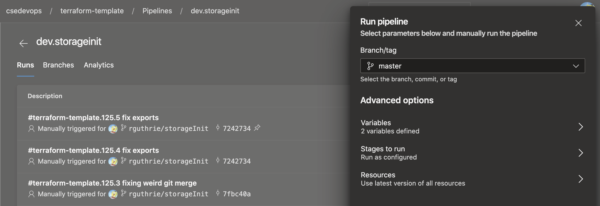
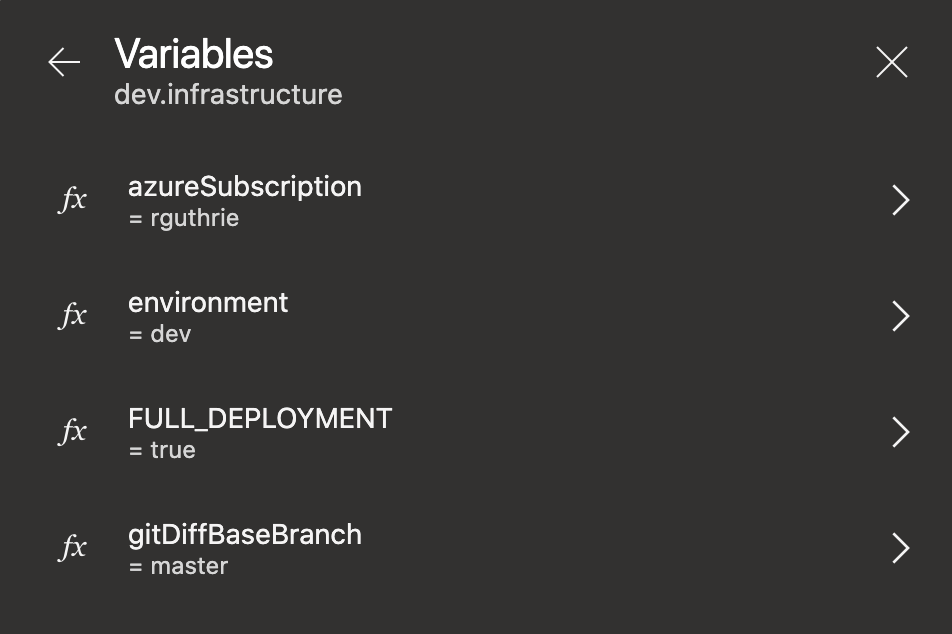
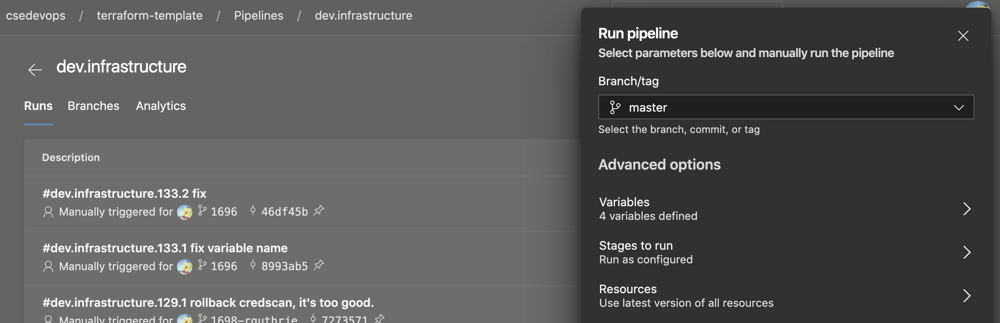

# Infrastructure Pipeline

## Overview

The infrastructure pipeline does the heavy lifting of CI/CD.  See [overview](./INFRASTRUCTUREPIPELINEOVERVIEW.md) for more details.

## Installation

See [Installation Documentation](./INSTALLATION.md)

## Scenarios and steps for Infrastructure Pipeline provisioning and execution

### Scenario 1: Greenfield (New Subscription)

1. Run **infrastructure/env_\<ENVIRONMENT\>/\<PIPELINE_PREFIX\>.storageinit-pipeline.\<ENVIRONMENT\>** and wait until it finish.

   

2. Run **infrastructure/env_\<ENVIRONMENT\>/\<PIPELINE_PREFIX\>.infrastructure-pipeline.\<ENVIRONMENT\>** with **FULL_DEPLOYMENT** variable set to **true**

   

   

### Scenario 2: Update Azure Resources based on changes

You can either run the pipeline with FULL_DEPLOYMENT set to true or you can set to false.  If set to false the pipeline will use the [gitDiff template](../azure-pipelines/templates/template.job.gitdiff.yml) to pick up deployments with changes and only run Terraform plan/apply pipelines against those deployments.  This approach speeds up overall execution time.

### Scenario 3: Update Azure Resources in a Specific Layer/Deployment

In addition to setting the value of FULL_DEPLOYMENT, you can also use the DEPLOYMENT_DIR variable to specify that the infrastructure pipeline should only run Terraform plan/apply pipelines against a specific layer and deployment. This approach speeds up overall execution time and is useful for debugging specific deployments or selectively running single deployments.

The DEPLOYMENT_DIR variable expects a valid folder path under Terraform-Code/terraform.

## Pipeline limitations

The infrastructure pipeline cannot handle the destroy of an entire deployment (IE, you intend to delete a deployment folder under a layer).  The workflow to delete a deployment is:

- Run [destroy pipeline](../azure-pipelines/pipeline.tfdestroy.yml) to destroy the infrastructure for a deployment.

- Create a branch in github repo.

- Delete the folder containing the deployment to be destroyed.

- Push the commit as a PR or run infrastructure pipeline.  This will trigger PR pipeline or you can manually run the infrastructure pipeline pointing it at your branch.

- Merge branch.
