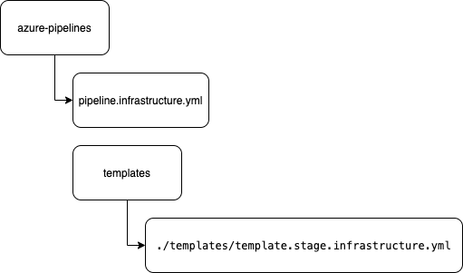
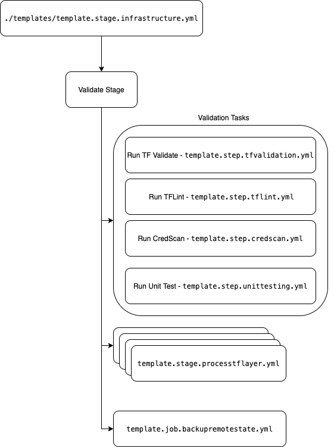
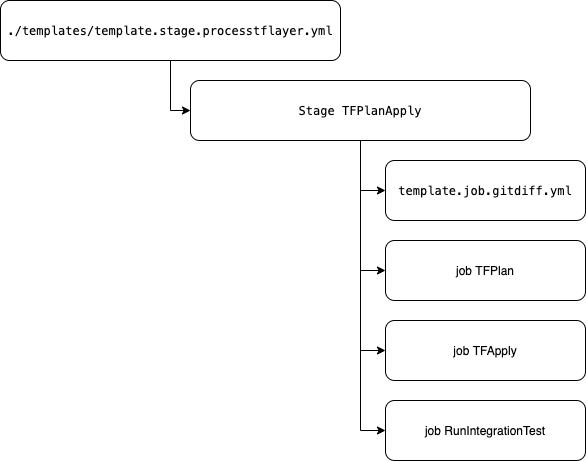
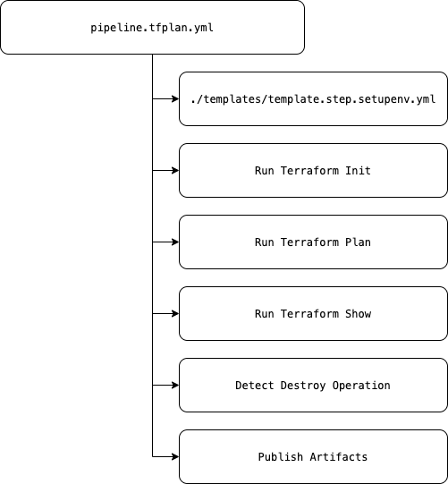
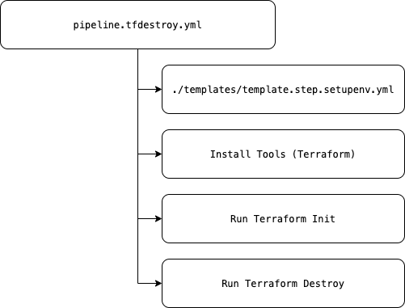

# INFRASTRUCTURE PIPELINE OVERVIEW

This document walks through the infrastructure pipeline components and explain how they work together to execute an end-to-end CI/CD for your project's terraform code.  The infrastructure pipeline leverages the [directory structure](./DIRECTORYSTRUCTURE.md) to scale out and deploy the terraform infrastructure.  Within a layer, scalability (number of parallel deployments) is limited only by the number of parallel jobs configured in Azure DevOps.  See [pipeline operations](./INFRASTRUCTUREPIPELINEOPERATIONS.md) for details on installing and running pipeline.

## pipeline.infrastructure.yml

Top level pipeline yaml file that is used to deploy infrastructure.  All [pipeline level variables](./PIPELINEVARIABLES.md) are declared and managed in this file.  This file contains a single template reference to [template.stage.infrastructure.yml](#template.stage.infrastructure.yml).



[Back To Top](#infrastructure-pipeline-overview)

## template.stage.infrastructure.yml

Stage template that contains all stages for validation (Continuous Integration), layer processing, Acceptance/Integration Testing and remote state backup.  

- Validation: The validation stage performs several CI task to ensure the terraform code is syntactically correct.  The task runs [MCSA Credential Scanner](https://aka.ms/mscadocs) to detect and alert for attempts to commit values that are or resemble secret values. The TF Validate and TFLint steps run [terraform validate](https://www.terraform.io/docs/commands/validate.html) and [tflint](https://github.com/terraform-linters/tflint) on all deployment directories to ensure the terraform code is well formed and passes linting rules.  The final validation step is to run unit test on the terraform helper codebase.  These test are found in the [helper directory](https://dev.azure.com/csedevops/terraform-template-public/_git/terraform-template-public/helper).

- Stage Processing: The layers are processed sequentially with testing run at the end of each layer (The template can easily be modified to run test prior to layer execution.  This can be useful to ensure that the configuration parameters, say from a prior layer, that the layer expects are available and valid.).  Within the layer, the pipeline will fan out/in and attempt to deploy as many deployments in parallel, up to the number of available parallel jobs for the project/ agent pool.

- Acceptance/Integration testing: Leveraging [Terratest](https://github.com/gruntwork-io/terratest), teams can create test that validate and test the deployed infrastructure to ensure it is functioning as expected.  Issues with configuration drift and expected outcomes should be tested and caught here.

The tags parameter is used by the [integration testing framework](#template.step.integrationtesting.yml) to filter available E2E/Integration test for the specific layer.  In doing so, the pipeline processes a layer and then test that the layer configuration is valid before moving to the next layer.  If layer processing fails or test fail, the operation/developer can review the pipeline artifacts and take corrective actions.  The pipeline operator/developer can then re-run failed jobs and the pipeline will pick up where it left off and continue processing.  

- Remote State Backup: This stage runs at the end of the pipeline and copies the remote state storage container to another storage account.  It tags the container with build id and commit hash of the build.



### Adding a layer

In order to create a new layer, you will copy the below YAML block above/below existing layers.  You would then set the layer name in **stageLayer** parameter, specify the **previousLayer** name, and set the **tags** parameter to be used by integration testing.

```YAML
  ################################
  # Plan and Apply Runtime Layer #
  ################################
  - template: template.stage.processtflayer.yml
    parameters:
      stageLayer: 03_runtime_environment
      previousLayer: TfPlanApply_02_networking
      tags: "03"
```

[Back To Top](#infrastructure-pipeline-overview)

## template.stage.processtflayer.yml

This is the primary template for processing terraform code changes.  This layer executes a [git diff](#template.job.gitdiff.yml) to extract the changed layers and deployments.  Once these list are created, the stage filters based on **stageLayer** parameter.  It then asynchronously executes terraform plan using RunPipelines task to execute the [terraform plan child pipeline](#pipeline.tfplan.yml).  This operation is done in parallel for all deployments in the layer.  After all plans are generated, plans are saved as pipeline artifacts for audibility.  

The pipeline then uses the same RunPipelines task to execute the [terraform apply child pipeline](#pipeline.tfapply.yml).  This pipeline does the actual infrastructure changes for the deployment.  Finally, the integration testing framework is run using the [integration testing stage](#template.step.integrationtesting.yml) which is passed the **tags** parameter.



### Example RunPipelines YAML configuration

The example below is YAML configuration for TF plan execution.  Documentation for this pipeline task can be found [here](https://marketplace.visualstudio.com/items?itemName=CSE-DevOps.RunPipelines).

```YAML
          - task: RunPipelines@2
            inputs:
              serviceConnection: "$(runPipelinesServiceConnection)"
              project: "$(System.TeamProject)"
              folderPath: "$(pipelineFolderPath)"
              buildDefinition: "$(pipelineName)"
              setBranch: false
              Branch: "$(Build.SourceBranch)"
              targetType: "inline"
              buildParameters: "$(runPipelinesBuildParameters)"
              customPrefix: "TfPlan-${{ parameters.stageLayer }}"
              waitForQueuedBuildsToFinish: true
              waitRefreshTime: "15"
              waitTimeOut: "60"
              downloadBuildArtifacts: true
              artifactDropDirectory: "$(Build.ArtifactStagingDirectory)"
              storeInOutputVariable: false
```

[Back To Top](#infrastructure-pipeline-overview)

## template.step.integrationtesting.yml

The integration testing template performs several steps to complete the integration testing.  It uses the tags parameters but if no tag is supplied it will run the full integration test suite.  The test suite currently requires GO version 1.14.2 or higher which is set in the **TOOL_VERSIONS** variable group.  See the [Testing Terraform Code](./TESTINGTERRAFORMCODE.md) and [Developer Guide for Testing](./DEVELOPERGUIDEFORTESTING.md) for more information on the testing framework and tests.

[Back To Top](#infrastructure-pipeline-overview)

## template.job.gitdiff.yml

This script creates a list of layers and deployments for the pipeline to operate against.  If the variable DEPLOYMENT_DIR is set to a specific deployment, the pipeline will only deploy that layer regardless of whether FULL_DEPLOYMENT is set to `true` or `false`.  If [FULL_DEPLOYMENT pipeline variable](./PIPELINEVARIABLES.md) is set to true, all layers and deployments will be processed.  If set to false, the script uses [git diff](https://git-scm.com/docs/git-diff) command to find the changed layers and deployments to run plan/apply against.

[Back To Top](#infrastructure-pipeline-overview)

## pipeline.tfplan.yml

The Terraform plan pipeline performs several operations.  Primarily the pipelines intent is to generate a plan and ensure the plan is valid. The Azure DevOps extension used for terraform commands is [Terraform Build & Release Tasks](https://marketplace.visualstudio.com/items?itemName=charleszipp.azure-pipelines-tasks-terraform). Here is a description of the operations performed:

- **Setup the environment** - This task downloads the environment .env file from secure files and sets a pipeline variable for each config value.  NOTE: [Environment variables behavior](https://docs.microsoft.com/azure/devops/pipelines/process/variables?view=azure-devops&tabs=yaml%2Cbatch#environment-variables) in Azure DevOps.
- **Run Terraform Init** - This step initializes the provider and sets up the remote state backend for terraform on agent.
- **Run Terraform Plan** - This step runs terraform plan using the .env file downloaded from secure files in _setup the environment_ step.
- **Run Terraform Show** - This step runs terraform show command using terraform pipeline extension.  The plan and json formatted output are saved as pipeline artifacts.
- **Detect Destroy Operation** - A warning is raised if a destroy operation is detected.  An artifact is also generated to put into the top level build outputs.  This behavior allows a terraform developer to evaluate if the destroy operation was intended in their terraform operations.
- **Publish Artifacts** -  Plan, json formatted plan output and destroy detection are published as outputs of pipeline.



[Back To Top](#infrastructure-pipeline-overview)

## pipeline.tfapply.yml

The Terraform apply pipeline does the actual CREATE, UPDATE, DESTROY _(see note below)_ operations against your project's infrastructure.  This pipeline sets up the environment, initializes the remote state backend, and does the apply operation.  This pipeline is generally restartable if an error is encountered.  **NOTE:** this pipeline will fail if you are attempting to destroy an entire deployment.  Steps to delete a deployment are listed in [infrastructure pipeline operations](./INFRASTRUCTUREPIPELINEOPERATIONS.md).


[Back To Top](#infrastructure-pipeline-overview)

## pipeline.tfdestroy.yml

This pipeline is most useful to destroy a deployment.  It performs an environment setup, remote state init and terraform destroy.  Follow the steps in [infrastructure pipeline operations](./INFRASTRUCTUREPIPELINEOPERATIONS.md) to perform a destroy of a deployment.



[Back To Top](#infrastructure-pipeline-overview)
