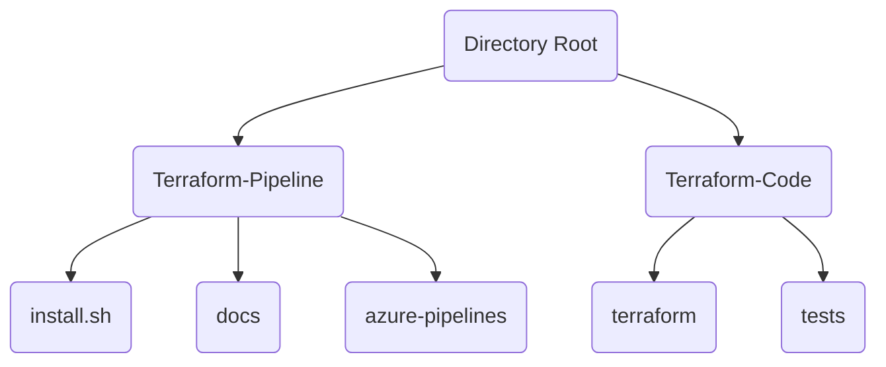

# Install Script Flags

This document outlines the different flag options that are available as part of the install script.

[install.sh](../tools/install/install.sh)

---

## SYNOPSIS

```shell
Usage: install.sh
    -o | --org <AZDO_ORG_NAME> (User if provisioning to Azure DevOps Service)
    -l | --server <Azure DevOps Server and Collection> (Ex. server/collectionName)
        Must specify the server and collection name
        Must also use -u parameter to specify the user
    -u | --user specifies the user to use with PAT on Azure DevOps server
    -n | --name <AZDO_PROJECT_NAME>
    -p | --pat <AZDO_PAT>
    -r | --region <REGION>
    -i | --installInternal (Optional: set if attempting to install internal version of CredScan)
    -c | --cloudName (Optional cloud name if service connection is for other cloud 'az cloud list')
       | --subName '<Azure Subscription Name>' (Optional - if included, can be ommitted from -s.)
                    ** Note: if the subscription name has spaces, you must use this input parameter. **
       | --metaDataHost The Hostname of the Azure Metadata Service (for example management.azure.com), used to obtain the Cloud Environment when using a Custom Azure Environment.

       | --private This flag indicates that the deployment target is an Azure Private Cloud.
       | --useExistingEnvs This flag indicates that you will use existing env files and it skips generating dev and prod env files and the environments folder.
    -s | --servicePrincipal <SP_INFORMATION>
            Expected Format:
            SUB_NAME='<Azure Subscription Name>' SP_ID=<Service Principal ID> SP_SUBSCRIPTION_ID=<Azure Subscription ID> SP_SECRET=<Service Principal Secret> SP_TENANT_ID=<Service Principal Tenant ID>
            ** Note: if the subscription name has spaces, you must use the --subName parameter. **
    --offline (Optional) Enable project creation without importing source from public repos. This will set up the project with files from this repo and the associated Terraform-Code Repo.
            ** Note: For offline to work, i is expected that the Terraform-Code repo sits alongside this (Terraform-Pipelines) repo.
    --sourceLocalPath (Optional) Root folder of Terraform-Code and Terraform-Pipelines repos. Default ~/tfsource.
            ** Note: Works only with --offline
    -d | --debug Turn debug logging on
```

---

## DESCRIPTION

The [install.sh](../tools/install/install.sh) creates a new Azure DevOps project in your organization and configures all the necessary pieces to have Terraform CI/CD. This includes pipelines, variable groups and a split repo structure.

For more details on the project installation process:

- [Project Installation](PROJECT_INSTALLATION.md)

- [Project Installation Scenarios](PROJECT_INSTALLATION_SCENARIOS.md)

---

## OPTIONS

Some script options(flags) allow for both a short-hand (-) and long-form (--) flag option. The convention used by the script is a single letter after a single dash for short form. Or a series of full words (one more more) if the flag starts with --. In the below options section, if an options has both a long form or a short form, either can be used.

---
<style>
    .option{
        color:#D98880ed;
        font-family:consolas;
        font-size:1.2em;
    }
</style>

```shell
-o <Azure DevOps Organization Name>
--org <Azure DevOps Organization Name>
```

 _Required_ value

The Azure DevOps organization name and is specifically for Azure DeveOps Hosted Services (PAAS). In most cases this is the organization name after <https://dev.azure.com>. For example, if you're organization url is <https://dev.azure.com/myorg>, then 'myorg' would be the value passed to this flag.

---

```shell
-l <Azure DevOps Server Name and Collection Name>
--server <Azure DevOps Server Name and Collection Name>
```

_Required_ value

***This option should not be used along with the (-o || --org). Either -l or -o should be specified depending on the target Azure DevOps Environment.***

The Azure DevOps Server url base url (without the protocol) name and is specifically for an installed Azure DeveOps Server.

---

```shell
-n <Azure DevOps Project Name>
--name <Azure DevOps Project Name>
```

_Required_ value

The name of the project to create in your Azure DevOps organization or collection. This should be a unique name and cannot be an existing project. The install process will create this new project and configure it.

---

```shell
-p <Azure DevOps PAT>
--pat <Azure DevOps PAT>
```

_Required_ value

<a name="CreateAPat"></a>

Create the PAT token used for installation following these steps ( [Azure DevOps PAAS](https://docs.microsoft.com/azure/devops/organizations/accounts/use-personal-access-tokens-to-authenticate?view=azure-devops&tabs=preview-page#create-a-pat) | [Azure DevOps Server 2020](https://docs.microsoft.com/azure/devops/organizations/accounts/use-personal-access-tokens-to-authenticate?view=azure-devops-2020&tabs=preview-page#create-a-pat) ).  Below are the minimum permissions required to execute the installation script using this PAT token.

### Minimum PAT token permissions

You will need to click ```Show all scopes``` at the bottom of the dialog before setting the specific permissions below:

<center>

| Scopes | Setting |
|---    |---    |
|   Build   |   Read & execute  |
|   Code  | Read, write, & manage |
|   Extensions  |   Read & manage   |
|   Graph   |   Read & manage   |
|   Identity    |   Read & manage   |
|   Project and Team  | Read, write, & manage |
|   Release|   Read, write, execute, & manage  |
|   Secure Files    | Read, create, & manage    |
|   Security   |    Manage  |
|   Service Connections |   Read, query, & manage   |
|   Variable Groups |   Read, create, & manage  |

</center>

---

```shell
--subName <Azure Subscription Name>
```

_Required_ value

The name of the target Azure subscription. To get the name of the subscription via the az cli:

`az account show --query '[name]'`

---

```shell
-s <SP_INFORMATION>
--servicePrincipal <SP_INFORMATION>
```

_Required_ value

This parameter is a space delimited string of key value pairs of meta data including Service Principal Client Id, Service Principal Secret, Azure Subscription Tenant Id and Azure Active Directory Tenant Id.

Expected Format:

```shell
SP_ID=<Service Principal ID> SP_SUBSCRIPTION_ID=<Azure Subscription ID> SP_SECRET=<Service Principal Secret> SP_TENANT_ID=<Service Principal Tenant ID>
```

---

```shell
-r <Region>
--region <Region>
```

_Required_ value

The [Azure Region](https://azure.microsoft.com/global-infrastructure/geographies/) in which to deploy infrastructure resources to. This will be used in the generated environment (.env) files.

Use the following command to get a list of locations via the az cli:

`az account list-locations --query '[].name' -o tsv`

---

```value
-u <User Name>
--user <User Name>
```

_Optional_ value

_Default Value:_ AzureUser

Specifies the user to use with PAT on Azure DevOps server.

---

```shell
-i
--installInternal
```

_Optional_ value

This should only be used if attempting to install an internal version of CredScan. This option is only for Azure DevOps organizations that are part of the Microsoft Tenant.

---

```value
-c <Azure Cloud Name>
--cloudName <Azure Cloud Name>
```

_Optional_ value

The desired target Azure Cloud. To get a list of cloud names via the azure cli:

`az cloud list -o table`

---

```shell
--metaDataHost <Meta Data Url>
```

_Optional_ value

This flag should be used when specifying a cloud other than Azure Commercial Cloud via the -c flag.

MetaData Host is the Hostname of the Azure Metadata Service, [used by Terraform to obtain the Cloud Environment when using a Custom Azure Environment.](https://www.terraform.io/docs/providers/azurerm/index.html#metadata_host)

To get the meta data uri:

- Find the resource manager uri for your desired cloud via the az cli.

  `az cloud show --query '[endpoints.resourceManager]'`

- Meta Data host is  
  
  `https://<resource manager uri>/metadata/endpoints?api-version=2020-06-01`

To get the meta host in a single command:

```shell
echo "$(az cloud show --query '[endpoints.resourceManager][0]' -o tsv)/metadata/endpoints?api-version=2020-06-01"
```

---

```shell
--private
```

_Optional_ value

This flag applies changes needed to the Terraform backend configuration when deploying to Azure Stack or Azure Private clouds. Specifically, there is a change required to the tfPlan and tfApply pipeline yaml files to enable remote state targeting an Azure Storage account on these environments.

---

```Shell
--useExistingEnvs
```

_Optional_ value

This flag allows for reusing values in Terraform-Code/environments. By default the install script creates a new environments folder with templated values. Including this flag, skips that process and imports your existing env files from disk.

---

```shell
--offline
```

_Optional_ value

This flag imports the Terraform-Code and Terraform-Pipelines repositories from the local disk rather than importing from the public Lucidity project. This is especially important since in an air-gapped environment, external network access may not be available.

For `--offline` to function correctly, it is expected that the Terraform-Code repo sits alongside this (Terraform-Pipelines) repo.  Below is a diagram of what the installer expects as layout.



---

```shell
--sourceLocalPath <Path>
```

_Optional_ value

Root folder of Terraform-Code and Terraform-Pipelines repos. Default is ~/tfsource.
This option should only be used alongside --offline. If --offline is not specified , is it unused.

---

```shell
-d
--debug
```

_Optional_ value

Enables debug logging. When debug logging is enabled the console output shows detailed information about the install process. In addition the folder ./temp will be retained, this folder contains output files for the different operations performed by the install script. This includes calls to the Azure DevOps api and the received response.
