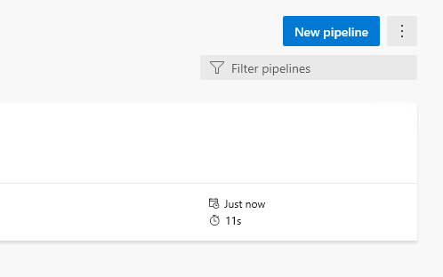
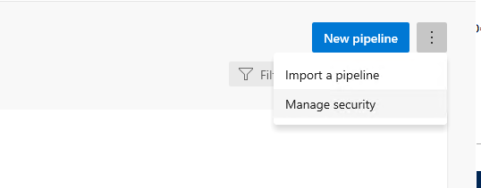
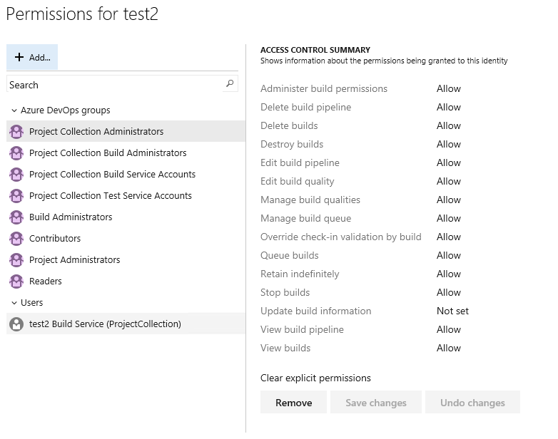
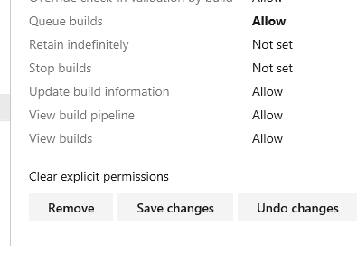

# Project Installation

To configure a new project you can run install.sh

For details on the different installation types and scenarios please see the [Install Script Scenarios guide](./PROJECT_INSTALLATION_SCENARIOS.md)

## Pre-requisites

- Bash Shell (In the future we will provide a dev container )
  - [Windows](https://docs.microsoft.com/windows/wsl/install-win10)
  - Mac OSX / Ubuntu (builtin)
- [jq](https://stedolan.github.io/jq/download/)
- ggrep (Mac OSX only) ```brew install ggrep```
- [Azure Cli](https://docs.microsoft.com/cli/azure/install-azure-cli?view=azure-cli-latest) version 2.5.0 or greater.

- [git](https://git-scm.com/downloads)

<span style="color:red">***NOTE: In order to run the infrastructure, you will also need to have a minimun of 3 parallel jobs configured for the organization.***</span>  Steps to check/adjust can be found [here](https://docs.microsoft.com/azure/devops/pipelines/licensing/concurrent-jobs?view=azure-devops).

## Installation Steps

### 1. Create a PAT token

See [Install Script Flags - Create a PAT](./INSTALL_SCRIPT_FLAGS.md?#CreateAPat) for information on how to create the PAT and minimum permissions required.

### 2. Create the service principal

Create a service principal in your Azure commercial subscription that has the necessary permissions to create your resources provisioned by terraform.

- Grab the subscription id:

    ```bash
    az account show\
        --subscription "<SUBSCRIPTION_NAME>"\
        --query "id"\
        --output tsv
    ```

- Create the Service Principal:

    ```bash
    az ad sp create-for-rbac\
        --name "<SP_NAME>"\
        --skip-assignment\
        --scope "/subscriptions/<SUBSCRIPTION_ID>"
    ```

- Assign required roles to your service principal (User Administrator, Contributor, Resource Policy Contributor):

You will need to determine what roles the service principal will require in order to provision resources in your Azure subscription.  This varies depending on the resources that will be deployed.  

#### Example

Using the app id from the output of the previous step.  The example below:

- Grants the service principal contributor rights to the subscription

- Resource Policy Contributor in order to allow the Service Principal set access policy for KeyVault

    ```bash
    az ad sp list\
        --display-name "<SP_NAME>"\
        --query "[].appId"\
        --output tsv

    az role assignment create\
        --assignee "<APP_ID_OF_SP>"\
        --role "Contributor"

    az role assignment create\
        --assignee "<APP_ID_OF_SP>"\
        --role "Resource Policy Contributor"
    ```

    > **_NOTE:_**  You will also need to manually assign the SP to the User Administrator role in Azure AD due to limitations with ```az role assignment create```.

- Collect the following values from your cmd line output:

```Bash
SP_ID=<Service Principal ID>
SP_SUBSCRIPTION_ID=<Azure Subscription ID>
SP_SECRET=<Service Principal Secret>
SP_TENANT_ID=<Service Principal Tenant ID>
```

### 3. Configure Project Locally

#### For Azure DevOps PAAS

  Using git, clone the following repos to your local machine and navigate to Terraform-Pipelines/tools/install folder from your BASH Shell. 

- [Terraform-Pipelines](https://csedevops@dev.azure.com/csedevops/terraform-template-public/_git/Terraform-Pipelines)

- [Terraform-Code](https://csedevops@dev.azure.com/csedevops/terraform-template-public/_git/Terraform-Code)

Please ensure that both repos (Terraform-Pipelines and Terraform-Code) are sibling directories under the same root folder. For example, if your working directory is ~/repos, then the path for both should be:
  * ~/repos/Terraform-Pipelines
  * ~/repos/Terraform-Code

#### For Azure DevOps Server (created with the AzDo Server Install Project)

  As part of the AzDo Server Install project, the Terraform-Pipelines and Terraform-Code repos are deployed to your agent vm.

  ```shell
  # The install.sh file should be at this location.
  cd ~/tfsource/Terraform-Pipelines/tools/install
  ```

### 4. Run the installation script

In the tools/install directory of the Terraform-Pipeline repo there are several scripts, ```install.sh``` will create a new Azure DevOps Project in your desired organization, provision the necessary pipelines and permissions and setup the repo with a default env file.  

**_NOTE:_ If installing on an internal Microsoft organization, add the _-i_ switch to get the internal version of Secure Development Tools extension.  Use of this switch on an external organization will cause the installation script to fail.**

The syntax for running this script is:

```Bash
# Depending on whether you are using Azure DevOps PAAS or Server, run one of the following commands below:

# Azure DevOps PAAS (dev.azure.com)
./install.sh -o <devops_organization_name> -n <name of project> -p <pat_token_created_in_step_1> -r <region_you_want_to_deploy_your_terraform_to> --subName "<Subscription Name>" -s "SP_ID=<Service Principal ID> SP_SUBSCRIPTION_ID=<Azure Subscription ID> SP_SECRET=<Service Principal Secret> SP_TENANT_ID=<Service Principal Tenant ID>" -c <cloud name, if deploying to a cloud other than AzurePublic>

# Azure DevOps Server 2020
sudo ./install.sh -l <server_url/collection> -n <name of project> -p <pat_token_created_in_step_1> -r <region_you_want_to_deploy_your_terraform_to> --subName "<Subscription Name>" -s "SP_ID=<Service Principal ID> SP_SUBSCRIPTION_ID=<Azure Subscription ID> SP_SECRET=<Service Principal Secret> SP_TENANT_ID=<Service Principal Tenant ID>" -c <cloud name, if deploying to a cloud other than AzurePublic>, --metaDataHost <host url if using a Custom Azure Environment>
```

***For a reference of all options available in the install script, see the [Install Script Flags document.](./INSTALL_SCRIPT_FLAGS.md)***

```Bash
Usage: install.sh
    -o | --org <AZDO_ORG_NAME> (User if provisioning to Azure DevOps Service)
    -l | --server <Azure DevOps Server and Collection> (Ex. server/collectionName)
        Must specify the server and collection name
        Must also use -u parameter to specify the user
    -u | --user specifies the user to use with PAT on Azure DevOps server
    -n | --name <AZDO_PROJECT_NAME>
    -p | --pat <AZDO_PAT>
    -r | --region <REGION>
    -i | --installInternal (Optional: set if attempting to install internal version of CredScan)
    -c | --cloudName (Optional cloud name if service connection is for other cloud 'az cloud list')
       | --subName '<Azure Subscription Name>' (Optional - if included, can be ommitted from -s.)
                    ** Note: if the subscription name has spaces, you must use this input parameter. **
       | --metaDataHost The Hostname of the Azure Metadata Service (for example management.azure.com), used to obtain the Cloud Environment when using a Custom Azure Environment.

       | --private This flag indicates that the deployment target is an Azure Private Cloud.
       | --useExistingEnvs This flag indicates that you will use existing env files and it skips generating dev and prod env files and the environments folder.
    -s | --servicePrincipal <SP_INFORMATION>
            Expected Format:
            SUB_NAME='<Azure Subscription Name>' SP_ID=<Service Principal ID> SP_SUBSCRIPTION_ID=<Azure Subscription ID> SP_SECRET=<Service Principal Secret> SP_TENANT_ID=<Service Principal Tenant ID>
            ** Note: if the subscription name has spaces, you must use the --subName parameter. **
    --offline (Optional) Enable project creation without importing source from public repos. This will set up the project with files from this repo and the associated Terraform-Code Repo.
            ** Note: For offline to work, it is expected that the Terraform-Code repo sits alongside this (Terraform-Pipelines) repo.
    --sourceLocalPath (Optional) Root folder of Terraform-Code and Terraform-Pipelines repos. Default ~/tfsource.
            ** Note: Works only with --offline
    -d | --debug Turn debug logging on
```

## Post installation tasks

### Azure DevOps Server 2020

  If you are installing the project on Azure DeveOp Server and not the hosted PAAS, there is an additional manual step that needs to be performed. You have to manually assign the allow queue permissions to your projects build service.

- Nagivgate to the main Pipelines page (under the Pipelines section on the left navigation.)  
  
    

- Click on the ellipsis on the top right.

- Select "Manage Security."

    

- Under the users section, select the Build Service for your project (it's usually the last item on the left column.)

    

- On the right side of the pop-up, you should see "ACCESS CONTROL SUMMARY."

- Ensure that Queue Builds is set to Allow by clicking it to cycle through options.

    

- Click the Save Changes Button at the bottom.

## Verification

There are a couple of verification checks that can be performed.  

- First, examine the output of the script and review for errors.  

- Second, verify the sucesss log message:

    ```Bash
    **** Successfully Created { Project Name } in { Org or Server Url }! ****
    ```

- Third, navigate to your org and review the new project.  You should have a repo setup with a default .env file in the root.  Examine that file to ensure it has the correct values.

- Run the **dev.storageinit** pipeline. This will setup the remote state storage account.

- Run the **dev.infrastructure** pipeline. This will deploy some sample resources. [Read more](./SAMPLERESOURCES.md) about sample resources.  

You are now ready to start developing terraform and test the deployed terraform.  

  See:

- [Directory Structure](./DIRECTORYSTRUCTURE.md)

- [Pipelines](./PIPELINES.md)

- [Testing Terraform Code](./TESTINGTERRAFORMCODE.md)

- [Testing Developer Guide](./DEVELOPERGUIDEFORTESTING.md)
