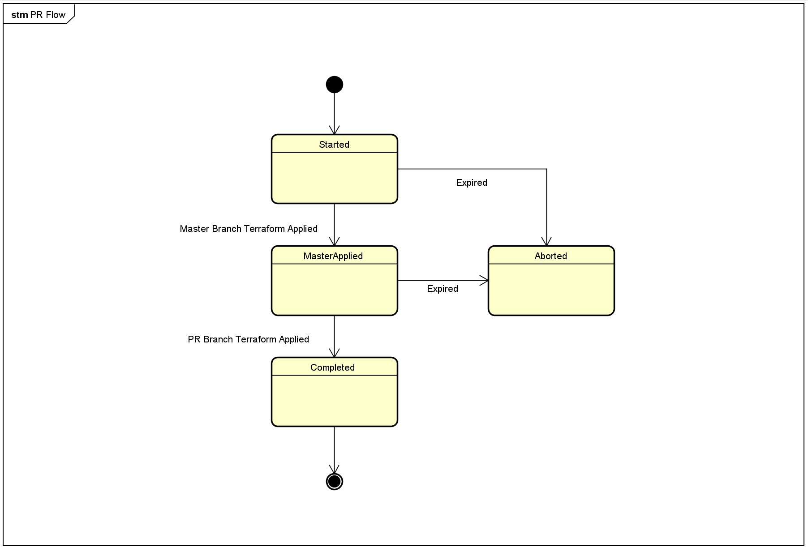

# Pull Request Pipelines

## Summary
As part of the project install, project lucidity configures a Pull Request workflow for infrastructure. This allows you to run deployments against a PR environment as part of your Terraform development workflow. Whenever changes are made to the terraform in the Terraform-Code repository, it's expected that changes will be merged in via pull requests.

As part of the install process, the pipelines and tooling to support the PR workflow is applied. In addition, there is a build validation rule that is added to the Terraform-Code repo to ensure that changes can't be pushed directly to master.

## Installation
The PR pipeline is automatically configured via the install script. The pieces needed to enable the PR workflow are:

* PR Pipelines including (```pr```, ```pr.storageinit```, ```pr.infrastructure```)
* PR Environment Variables in ```Terraform-Code/environments/pr```
* Variable Group: pullrequest.state (A more detailed description of the variable group can be [found here.](#pr-state-(variable-group)))

## Configuring PR Remote State
After the install script has completed, please run the pr.storageinit pipeline in order to configure the needed storage account used for [Terraform remote state](https://docs.microsoft.com/azure/developer/terraform/store-state-in-azure-storage).

## Workflow
The PR pipline applies the following high level workflow when started:

* Terraform Plan and Apply is applied from the master branch to the PR environment.
* Terraform Plan and Apply is applied from the incoming feature branch to the PR environment.
* PR Environment is destroyed and cloud resources are removed. 
    Note: There is an option to allow you to skip this stage, if you choose to leave the PR environment running post build. This can be configured via pipeline variable in the pr pipeline. Setting the pipeline variable autoDestroy to false will disable environment teardown.

Please see the [scenarios table below](#scenarios) for a detailed description or the expected scenarios as part of the PR workflow.

## Pipeline Execution and State
The PR pipeline deploys resource to Azure, and as a result there can only be one instance of the PR pipeline running at a time. As part of the PR pipeline workflow, state is maintained in a variable group called ```pullrequest.state```. 

This allows pipelines to request a "lock" and ensure that subsequent PR build are not run until the lock is released. This prevents new feature branches from impacting an existing PR deployment and possibly affecting tests.

## PR State (Variable Group)
The locking state mechanism used by the PR pipeline depends on the variable group ```pullrequest.state```. The following 3 variables are used to maintain state. As part of the PR pipline these variables are updated automatically with the appropriate information.

| ExpireDate | PullRequestNumber | Status |
| --- | ----------- | ------------- 
| Expiration date of the active PR. This is usually 6 days from the last PR update. |  The active PR Id. | The status of the active PR. The PR pipeline is considered locked if the state is Started or MasterApplied. See the [PR Status section below](#pr-status).

<br/>

---

## PR Status

| Status | Locked (Y/N) | Description |
| -------| ------------ | ----------- |
| ```Started```| locked       | There is an Active PR build that is running. This enables the deployment of the master branch to the PR environment. |
| ```MasterApplied``` | locked | This state indicates that the configuration in the master branch was applied to the PR environment. This is a condition for deploying configurations from a feature branch into the PR environment.|
| ```Completed``` | unlocked | This indicates that the PR build is successful and releases the lock. |
| ```Aborted``` | unlocked | This state indicates that a PR has expired (default expiration is 6 days) or that it has been aborted. |

<br/>
<i>Note: A NEW PR can will only run deployments if the variable group is set to Completed or Aborted. Any of the other states indicate that an existing PR is in flight and the incoming PR will be rejected until the active PR completes. </i>
<br/>

## Pipelines

* pr - This is the main PR pipeline that fires as part of the workflow.
* pr.storageinit - Configures the storage account used for remote state. This only needs to be run once as part of project configuration.
* pr.instrastructure - This pipeline does the deployment into the PR environment from the specific branch. This pipeline will be invoked by the main pr pipeline.

--- 



---

## Scenarios

|No. | Description |
| --- | --- 
| 1. | [New pull request is opened with no active PRs. Pipeline Configuration specifies autoDestroy=true](#scenario-1) |
| 2. | [New pull request is opened with no active PRs. Pipeline Configuration specifies autoDestroy=false](#scenario-2) |
| 3. | [A current PR is currently in process, when a pull request is opened](#scenario-3) |
| 4. | [A previously started pull request is re-queued after failing on Apply Master](#scenario-4) |
| 5. | [A previously started pull request is re-queue after failing on apply feature branch](#scenario-5) |
| 6. | [An expired PR that was previously completed is re-queued](#scenario-6)  |
| 7. | [An expired PR that is in flight is re-queued](#scenario-7) | 

### Scenario 1
### New pull request is opened with no active PRs. Pipeline Configuration specifies autoDestroy=true:
A new pull request is created to merge a feature branch into master. There are no other active PRs. The feature branch includes terraform changes.

The following table outlines the PR worklow and changes to the state that will be persisted to the variable group:
|Action | Status | ExpireDate | PullRequestNumber |
| ---   | --- | ----------- | ------------- 
| Initial State | Completed or Aborted | Valid Past Date | Old PR Number or 0
| PR Pipline starts running  | Started | 6 Days from Current Date | Current PR Number 
| Master Branch is Applied to PR Environment | MasterApplied | 6 Days from Current Date | Current PR Number 
| Feature Branch is Applied to PR Environment | Completed | 6 Days from Current Date | Current PR Number 
| PR Environment is Destroyed | Completed | 6 Days from Current Date | Current PR Number 
<br/>

---

### Scenario 2
### New pull request is opened with no active PRs. Pipeline Configuration specifies autoDestroy=false:
A new pull request is created to merge a feature branch into master. There are no other active PRs. The feature branch includes terraform changes. The PR Pipeline configuration has been altered so the autoDestroy pipeline variable is set to false.

The following table outlines the PR worklow and changes to the state that will be persisted to the variable group:
|Action | Status | ExpireDate | PullRequestNumber |
| ---   | --- | ----------- | ------------- 
| Initial State | Completed or Aborted | Valid Past Date | Old PR Number or 0
| PR Pipline starts running  | Started | 6 Days from Current Date | Current PR Number 
| Master Branch is Applied to PR Environment | MasterApplied | 6 Days from Current Date | Current PR Number 
| Feature Branch is Applied to PR Environment | Completed | 6 Days from Current Date | Current PR Number 

Note: In this scenario, destruction of the PR enviornment is skipped.
<br/>

---

### Scenario 3
### A current PR is currently in process, when a pull request is opened:
In this scenario there is an existing pull request that is in flight. As a result, the incoming pull request cannot secure a lock and will not cause a deployment to happen. The PR pipeline will report an a lock error and halt execution.

The following table outlines the PR worklow and changes to the state that will be persisted to the variable group:
|Action | Status | ExpireDate | PullRequestNumber |
| ---   | --- | ----------- | ------------- 
| Initial State | MasterApplied | Valid Future Date | Unique PR Number that is no the same as the current PR.
| PR Pipline starts running and exits with a lock error  | MasterApplied | Valid Future Date | Unique PR Number that is no the same as the current PR.
<br/>

---

### Scenario 4
### A previously started pull request is re-queued after failing on Apply Master. 
In this scenario a PR build that was in flight is required before the MasterApplied status is set. This is often the result of a re-run due to a failing of the deployment of the master branch.

The following table outlines the PR worklow and changes to the state that will be persisted to the variable group:
|Action | Status | ExpireDate | PullRequestNumber |
| ---   | --- | ----------- | ------------- 
| Initial State | Started | Valid Future Date | Current PR Number
| PR Pipline starts running  | Started | 6 Days from Current Date | Current PR Number 
| Master Branch is Applied to PR Environment | MasterApplied | 6 Days from Current Date | Current PR Number 
| Feature Branch is Applied to PR Environment | Completed | 6 Days from Current Date | Current PR Number 
| PR Environment is Destroyed | Completed | 6 Days from Current Date | Current PR Number 

In this scenario, the pipeline will run and will attempt to apply master.
<br/>

---

### Scenario 5
### A previously started pull request is re-queue after failing on apply feature branch. 
In this scenario a PR encounters an error when deploying the feature branch terraform configuration. The expected workflow is that an engineer will fix the issue in the Terraform and repush the feature branch. Because there is an open pull request. This will automatically trigger a rebuild of the PR pipeline.

Because the master branch was applied on a previous run of the PR Pipeline, it is skipped for subsequent runs. This is made possible via the MasterApplied status.

The following table outlines the PR worklow and changes to the state that will be persisted to the variable group:
|Action | Status | ExpireDate | PullRequestNumber |
| ---   | --- | ----------- | ------------- 
| Initial State | MasterApplied | Valid Future Date | Current PR Number
| PR Pipline starts running  | MasterApplied | 6 Days from Current Date | Current PR Number 
| Master Branch apply is skipped | MasterApplied | 6 Days from Current Date | Current PR Number 
| Feature Branch is Applied to PR Environment | Completed | 6 Days from Current Date | Current PR Number 
| PR Environment is Destroyed | Completed | 6 Days from Current Date | Current PR Number 
<br/>

---

### Scenario 6
### An expired PR that was previously completed is re-queued 
In this scenario a PR that was previously run and has a possible state of Completed. In thise case the Pipeline will update the status accordingly, trigger a complete deployment of master and feature branch and update the expire date.

The following table outlines the PR worklow and changes to the state that will be persisted to the variable group:
|Action | Status | ExpireDate | PullRequestNumber |
| ---   | --- | ----------- | ------------- 
| Initial State | Completed  | Expired past date| Current PR Number 
| PR Pipline starts running  | Started | 6 Days from Current Date | Current PR Number 
| Master Branch is Applied to PR Environment | MasterApplied | 6 Days from Current Date | Current PR Number 
| Feature Branch is Applied to PR Environment | Completed | 6 Days from Current Date | Current PR Number 
| PR Environment is Destroyed | Completed | 6 Days from Current Date | Current PR Number 
<br/>

---

### Scenario 7
### An expired PR that is in flight is re-queued 
In this scenario a PR that was previously run and stopped after applying master has expired. This scenario would occur if there was an error deploying the feature branch and a fix or update was not pushed before the 6 day expiration date. 

If a chance is pushed after the expiration date, the pipeline will run but the PR is considered expired and the build will fail. The status will be updated to aborted and expiration date will be udpated.

The following table outlines the PR worklow and changes to the state that will be persisted to the variable group:
|Action | Status | ExpireDate | PullRequestNumber |
| ---   | --- | ----------- | ------------- 
| Initial State |  Aborted | Expired past date| Current PR Number 
| PR Pipline starts does not run and exits with an error  | aborted | 6 Days from Current Date | Current PR Number 

Recovery: Re-queue the check. Since the status was updated to aborted and the expire date was modified, you should be able to re-queue the check. Between the aborted state and requeing the build, it is possible that another PR could trigger a pipeline run. In this case, your active PR will be in the queue and able to run when the lock is released.
<br/>

---


## Error Recovery

If the PR workflow is in an invalid state, a quick fix is to update the pullrequest.state variable group so Status is Aborted or Completed, and PullRequestNumber is 0. This resets the state and should allow a new PR to go through.


---

## Unit Tests
The PR pipeline logic is driven by the [checkstatus.sh](azure-pipelines/scripts/checkstatus.sh) script. The script is covered by unit and integration tests written for [shellspec](https://github.com/shellspec/shellspec) and uses a BDD dsl to describe the tests.

Tests:
* [Unit Tests](azure-pipelines/scripts/test/unit/checkstatus_spec.sh)
* [Integration Tests](azure-pipelines/scripts/test/integration/checkstatus_spec.sh)

To run the tests:

* Ensure [shellspec is installed](https://github.com/shellspec/shellspec#installation)
* ```cd azure-pipelines/scripts```
* ```shellspec test```

##### Running a subset of tests
* To only run unit tests: ```shellspec test/unit```
* To only run integration tests: ```shellspec test/integration```
